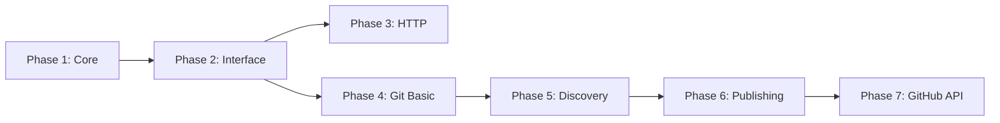

# Registry Types Implementation - Master Plan

## Executive Summary

This master plan coordinates the implementation of registry types for RuleStack (rfh), introducing support for Git-based package registries alongside the existing HTTP-based registry. The implementation is divided into 7 phases, each building upon the previous to create a complete solution.

## Goals

1. **Introduce Registry Types**: Enable multiple registry implementations (HTTP, Git)
2. **Git Registry Support**: Full support for Git-based package registries
3. **GitHub Integration**: Automated PR workflow for package publishing
4. **Maintain Compatibility**: Existing HTTP registries continue working unchanged
5. **Clean Architecture**: Well-structured, extensible design for future registry types

## Implementation Phases

### Phase 1: Registry Type Core Architecture
**File**: [01-registry-type-core.md](01-registry-type-core.md)
- Add registry type field to configuration
- Update CLI commands to handle types
- Implement backward compatibility
- **Duration**: 1-2 days
- **Dependencies**: None

### Phase 2: Registry Client Interface
**File**: [02-registry-client-interface.md](02-registry-client-interface.md)
- Create RegistryClient interface
- Define common data structures
- Implement factory pattern
- Create error types
- **Duration**: 1-2 days
- **Dependencies**: Phase 1

### Phase 3: HTTP Client Refactoring
**File**: [03-http-client-refactoring.md](03-http-client-refactoring.md)
- Refactor existing HTTP client to implement interface
- Add context support
- Update CLI commands to use new interface
- **Duration**: 2-3 days
- **Dependencies**: Phases 1-2

### Phase 4: Git Client Basic Operations
**File**: [04-git-client-basic.md](04-git-client-basic.md)
- Implement Git repository operations
- Add authentication support
- Create caching mechanism
- **Duration**: 2-3 days
- **Dependencies**: Phases 1-2

### Phase 5: Git Registry Search and Discovery
**File**: [05-git-registry-discovery.md](05-git-registry-discovery.md)
- Implement package search
- Add package/version retrieval
- Create index management
- Implement archive download
- **Duration**: 2-3 days
- **Dependencies**: Phase 4

### Phase 6: Git Registry Publishing
**File**: [06-git-registry-publishing.md](06-git-registry-publishing.md)
- Implement branch creation
- Add file staging and commits
- Create push functionality
- **Duration**: 3-4 days
- **Dependencies**: Phases 4-5

### Phase 7: GitHub API Integration
**File**: [07-github-api-integration.md](07-github-api-integration.md)
- Implement GitHub API client
- Add fork management
- Create PR automation
- Handle rate limiting
- **Duration**: 2-3 days
- **Dependencies**: Phase 6

## Total Timeline

- **Estimated Duration**: 14-20 days
- **Parallelization Opportunities**:
  - Phase 3 can start after Phase 2
  - Phase 4 can start after Phase 2
  - Phases 5-7 must be sequential

## Recommended Implementation Order



### Sequential Approach (Recommended for single developer)
1. Phase 1: Registry Type Core
2. Phase 2: Registry Client Interface
3. Phase 3: HTTP Client Refactoring
4. Phase 4: Git Client Basic
5. Phase 5: Git Registry Discovery
6. Phase 6: Git Registry Publishing
7. Phase 7: GitHub API Integration

### Parallel Approach (For team development)
- **Track 1**: Phase 1 → Phase 2 → Phase 3
- **Track 2**: (After Phase 2) → Phase 4 → Phase 5 → Phase 6 → Phase 7
- **Integration**: Merge tracks after Phase 3 completes

## Key Design Decisions

### 1. Registry Type System
- Explicit type field in configuration
- Automatic migration for existing registries
- Type validation at configuration load time

### 2. Client Interface Design
- Polymorphic RegistryClient interface
- Factory pattern for client instantiation
- Context support for all operations
- Structured error types

### 3. Git Registry Structure
```
packages/
├── package-name/
│   ├── metadata.json
│   └── versions/
│       └── v1.0.0/
│           ├── manifest.json
│           └── archive.tar.gz
└── index.json
```

### 4. Publishing Workflow
- Fork → Branch → Commit → Push → PR
- Automated PR creation via GitHub API
- No direct commits to main branch

## Testing Strategy

### Unit Testing
- Each phase includes specific unit tests
- Mock implementations for interfaces
- Test coverage target: 80%

### Integration Testing
- End-to-end registry operations
- Cross-registry type testing
- Authentication and authorization

### Manual Testing
- Each phase includes testing checklist
- User acceptance testing after each phase
- Performance testing for large repositories

## Risk Mitigation

### Technical Risks
1. **Large Git Repositories**
   - Mitigation: Implement shallow clones, caching
   
2. **GitHub API Rate Limits**
   - Mitigation: Rate limit checking, exponential backoff
   
3. **Breaking Changes**
   - Mitigation: Comprehensive testing, backward compatibility

### Process Risks
1. **Scope Creep**
   - Mitigation: Strict phase boundaries, clear requirements
   
2. **Integration Issues**
   - Mitigation: Interface-driven design, continuous testing

## Success Metrics

1. **Functionality**
   - All existing HTTP registry operations work unchanged
   - Git registry supports all required operations
   - PR creation automation works reliably

2. **Performance**
   - Git operations complete within reasonable time
   - Efficient caching reduces network calls
   - Search performance acceptable for large registries

3. **Usability**
   - Clear error messages
   - Intuitive CLI commands
   - Comprehensive documentation

## Configuration Examples

### HTTP Registry (existing)
```toml
[registries.public]
url = "https://registry.rulestack.dev"
type = "remote-http"
jwt_token = "eyJ..."
```

### Git Registry (new)
```toml
[registries.github]
url = "https://github.com/org/rulestack-registry"
type = "git"
git_token = "ghp_..."
```

## CLI Command Examples

### Adding Registries
```bash
# HTTP registry
rfh registry add public https://registry.rulestack.dev --type remote-http

# Git registry
rfh registry add github https://github.com/org/registry --type git
```

### Publishing to Git Registry
```bash
# Authenticate
export GITHUB_TOKEN=ghp_xxxxxxxxxxxx

# Publish (creates PR automatically)
rfh publish --registry github
```

## Future Enhancements

After completing all phases, consider:

1. **Additional Git Platforms**
   - GitLab integration
   - Bitbucket support
   - Generic Git support

2. **Advanced Features**
   - Package signing
   - Automated PR merging
   - Webhook integration
   - CI/CD integration

3. **Performance Optimizations**
   - Shallow clones
   - Parallel operations
   - Advanced caching strategies

4. **User Experience**
   - Interactive PR creation
   - PR status tracking
   - Publish progress indicators

## Deliverables

Each phase delivers:
1. Implementation code
2. Unit tests
3. Integration tests
4. Documentation updates
5. Testing checklist completion

## Final Checklist

Before considering the implementation complete:

- [ ] All 7 phases implemented
- [ ] All tests passing
- [ ] Documentation updated
- [ ] Backward compatibility verified
- [ ] Performance benchmarks acceptable
- [ ] Error handling comprehensive
- [ ] Code review completed
- [ ] User acceptance testing passed

## Support and Maintenance

### Documentation Requirements
- Update README with registry types
- Create Git registry setup guide
- Document GitHub token requirements
- Add troubleshooting guide

### Monitoring
- Track registry operation metrics
- Monitor API rate limit usage
- Log publishing success/failure rates

## Conclusion

This implementation plan provides a structured approach to adding Git registry support to RuleStack. The phased approach ensures each component is properly tested before moving to the next, reducing risk and ensuring quality. The modular design allows for future registry types to be added with minimal disruption to existing code.